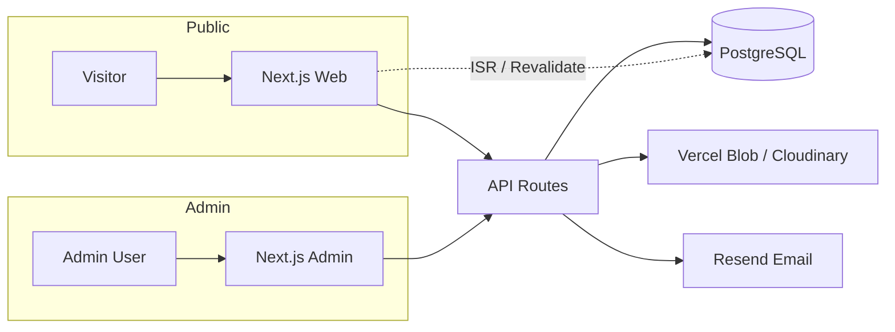

# Kế hoạch xây dựng Website Agency — Sergio Agency

> **Mục tiêu:** Website giới thiệu agency cung cấp dịch vụ thiết kế website & landing page — hiện đại, gần gũi, đẹp mắt với animation mượt mà, kèm hệ thống quản trị nội dung (CMS) riêng.

---

## 1. Tổng quan dự án

### 1.1 Đối tượng & mục đích

| Hạng mục | Mô tả |
|----------|-------|
| **Đối tượng** | Doanh nghiệp SME, startup, cá nhân cần website / landing page |
| **Mục tiêu site** | Thu hút lead, showcase portfolio, xây dựng uy tín thương hiệu |
| **Tone** | Hiện đại · Gần gũi · Chuyên nghiệp · Có "wow factor" qua animation |

### 1.2 Phạm vi chức năng

#### Frontend (Website công khai)

| # | Trang | Route | Mô tả |
|---|-------|-------|-------|
| 1 | **Trang chủ** | `/` | Hero, dịch vụ nổi bật, dự án tiêu biểu, CTA liên hệ |
| 2 | **Dịch vụ** | `/dich-vu` | Danh sách dịch vụ (thiết kế website, landing page…) |
| 3 | **Chi tiết dịch vụ** | `/dich-vu/[slug]` | Mô tả chi tiết, quy trình, bảng giá tham khảo |
| 4 | **Dự án** | `/du-an` | Grid portfolio, filter theo loại dự án |
| 5 | **Chi tiết dự án** | `/du-an/[slug]` | Gallery, mô tả, tech stack, link demo |
| 6 | **Bài viết** | `/bai-viet` | Danh sách blog, phân trang, filter tag |
| 7 | **Chi tiết bài viết** | `/bai-viet/[slug]` | Nội dung đầy đủ, TOC, bài liên quan |
| 8 | **Liên hệ** | `/lien-he` | Form gửi brief, thông tin liên hệ, map |
| 9 | **Đăng nhập** | `/dang-nhap` | Form login — redirect admin nếu có quyền |
| 10 | **Đăng ký** | `/dang-ky` | Form đăng ký tài khoản (tuỳ chính sách) |
| — | *Phụ trợ* | `/quen-mat-khau`, `/404` | Quên mật khẩu, trang lỗi |

#### Backend (Admin Dashboard)

| # | Trang | Route | Mô tả |
|---|-------|-------|-------|
| 1 | **Tổng quan** | `/dashboard` | Stats, biểu đồ, leads mới, hoạt động gần đây |
| 2 | **Dự án** | `/dashboard/du-an` | CRUD dự án, upload ảnh, publish/draft |
| 3 | **Bài viết** | `/dashboard/bai-viet` | CRUD bài viết, rich text editor, tags |
| 4 | **Settings** | `/dashboard/settings` | Thông tin site, SEO, social, tài khoản admin |

> **Ghi chú:** Dịch vụ và Leads có thể quản lý trong **Settings** hoặc bổ sung menu riêng ở phase sau nếu cần.

---

## 2. Kiến trúc & Công nghệ đề xuất

### 2.1 Quyết định kỹ thuật

| Layer | Công nghệ | Lý do chọn |
|-------|-----------|------------|
| **Frontend** | **Next.js 15** (App Router) | SSR/SSG tốt cho SEO, deploy Vercel native, React Server Components |
| **Styling** | **Tailwind CSS v4** + **Framer Motion** | Utility-first, animation agency-grade |
| **Backend API** | **Next.js Route Handlers** hoặc **Node.js (Hono/Fastify)** | REST API / tRPC cho admin & public |
| **Database** | **PostgreSQL** + **Prisma ORM** | Quan hệ rõ ràng, type-safe, migrate dễ |
| **Auth (Admin)** | **NextAuth.js v5** hoặc **Clerk** | Bảo vệ route `/admin`, session JWT |
| **File storage** | **Vercel Blob** / **Cloudinary** | Ảnh portfolio, thumbnail blog |
| **Email** | **Resend** / **Nodemailer** | Gửi thông báo form liên hệ |
| **Deploy** | **Vercel** (frontend + API) + **Neon/Supabase** (DB) | Zero-config, preview deploy |

> **Khuyến nghị:** Dùng **monorepo Turborepo** với 2 app Next.js tách biệt — dễ scale và bảo mật admin tốt hơn.

### 2.2 Cấu trúc thư mục đề xuất

```
sergio-agency/
├── apps/
│   ├── web/                 # Website công khai (sergio-agency.vercel.app)
│   │   ├── app/
│   │   │   ├── (marketing)/       # layout chung: nav, footer
│   │   │   │   ├── page.tsx           # Trang chủ /
│   │   │   │   ├── dich-vu/
│   │   │   │   │   ├── page.tsx       # Danh sách dịch vụ
│   │   │   │   │   └── [slug]/page.tsx
│   │   │   │   ├── du-an/
│   │   │   │   │   ├── page.tsx       # Danh sách dự án
│   │   │   │   │   └── [slug]/page.tsx
│   │   │   │   ├── bai-viet/
│   │   │   │   │   ├── page.tsx       # Danh sách bài viết
│   │   │   │   │   └── [slug]/page.tsx
│   │   │   │   └── lien-he/page.tsx
│   │   │   ├── (auth)/            # layout auth (không nav marketing)
│   │   │   │   ├── dang-nhap/page.tsx
│   │   │   │   ├── dang-ky/page.tsx
│   │   │   │   └── quen-mat-khau/page.tsx
│   │   │   └── api/               # contact, auth, revalidate
│   │   ├── components/
│   │   ├── lib/
│   │   └── public/
│   │
│   └── admin/               # Dashboard (admin.sergio-agency.vercel.app)
│       ├── app/
│       │   ├── (dashboard)/
│       │   │   ├── page.tsx           # Tổng quan
│       │   │   ├── du-an/             # CRUD dự án
│       │   │   ├── bai-viet/          # CRUD bài viết
│       │   │   └── settings/          # Cài đặt
│       │   └── api/
│       └── components/
│
├── packages/
│   ├── database/            # Prisma schema + client
│   ├── ui/                  # Shared components (Button, Card, Input...)
│   ├── config/              # ESLint, Tailwind, TS config
│   └── types/               # Shared TypeScript types
│
├── plan.md
├── turbo.json
└── package.json
```

### 2.3 Sơ đồ luồng dữ liệu



---

## 3. Chi tiết từng trang

### 3.1 Frontend — Website công khai

#### Trang chủ `/`
- Hero fullscreen + headline + CTA "Bắt đầu dự án"
- Section dịch vụ (preview 3–4 card)
- Section dự án nổi bật (featured projects)
- Section quy trình làm việc (4 bước)
- Section bài viết mới nhất (3 bài)
- CTA liên hệ + Footer

#### Dịch vụ `/dich-vu` + `/dich-vu/[slug]`
- **Listing:** Grid card dịch vụ, icon, mô tả ngắn
- **Detail:** Mô tả đầy đủ, danh sách tính năng, quy trình, FAQ, CTA liên hệ

#### Dự án `/du-an` + `/du-an/[slug]`
- **Listing:** Masonry/grid, filter theo category (Website, Landing Page, E-commerce…)
- **Detail:** Cover image, gallery, mô tả dự án, client, tech stack, link live demo, dự án liên quan

#### Bài viết `/bai-viet` + `/bai-viet/[slug]`
- **Listing:** Card bài viết, phân trang, filter theo tag/category
- **Detail:** Cover, nội dung rich text, mục lục (TOC), share social, bài liên quan

#### Liên hệ `/lien-he`
- Form: Họ tên, Email, SĐT, Dịch vụ quan tâm, Ngân sách, Nội dung
- Thông tin liên hệ (email, phone, địa chỉ)
- Map embed (Google Maps — optional)
- Validation client + server, thông báo gửi thành công

#### Đăng nhập `/dang-nhap` + Đăng ký `/dang-ky`
- Form email + password
- Link quên mật khẩu
- Sau login: redirect `/dashboard` (admin) hoặc trang chủ (user thường)
- OAuth Google (optional, phase sau)

### 3.2 Backend — Admin Dashboard

#### Tổng quan `/dashboard`
- Widget stats: Tổng dự án, bài viết, leads mới (7 ngày)
- Biểu đồ leads theo tháng
- Danh sách hoạt động gần đây (bài mới, dự án cập nhật)
- Quick actions: Tạo bài viết, Tạo dự án

#### Dự án `/dashboard/du-an`
- **Danh sách:** Table search, filter status (draft/published), sort
- **Tạo/Sửa:** Title, slug, mô tả, gallery upload, category, client, URL demo, featured toggle, publish
- **Xóa:** Confirm dialog

#### Bài viết `/dashboard/bai-viet`
- **Danh sách:** Table search, filter draft/published, tags
- **Tạo/Sửa:** Title, slug, excerpt, rich text (Tiptap), cover image, tags, publish schedule
- **Preview:** Xem trước trên site public

#### Settings `/dashboard/settings`
- **Thông tin site:** Tên, tagline, logo, favicon
- **Liên hệ:** Email, phone, địa chỉ, social links
- **SEO:** Meta title/description mặc định, OG image
- **Dịch vụ:** Quản lý danh sách dịch vụ (nếu không tách menu riêng)
- **Tài khoản:** Đổi mật khẩu, quản lý admin users

---

## 4. Hướng thiết kế UI/UX

### 4.1 Phong cách visual — "Editorial Agency"

Áp dụng phong cách **gần gũi nhưng cao cấp** (không quá corporate, không quá playful):

| Yếu tố | Đề xuất |
|--------|---------|
| **Palette** | Nền cream/warm white `#FDFBF7`, ink `#111`, accent gradient tím-xanh hoặc coral nhẹ |
| **Typography** | Display: **Clash Display** / **Plus Jakarta Sans** — Body: **Geist** / **DM Sans** |
| **Layout** | Bento grid bất đối xứng, whitespace rộng (`py-24`–`py-40`) |
| **Cards** | Double-bezel (nested border), glass morphism nhẹ trên nav |
| **Ảnh** | Portfolio full-bleed, hover parallax nhẹ |

### 4.2 Animation & Motion

| Hiệu ứng | Công cụ | Mô tả |
|----------|---------|-------|
| Scroll reveal | Framer Motion `whileInView` | Fade-up + blur resolve khi vào viewport |
| Hero text | GSAP hoặc Framer | Stagger từng từ / dòng |
| Nav | CSS + Framer | Floating pill navbar, menu overlay stagger |
| Button hover | Tailwind `group` | Magnetic feel, icon nested circle |
| Page transition | `template.tsx` Next.js | Crossfade giữa các trang |
| Cursor (optional) | Custom cursor | Chỉ desktop, tắt trên mobile |

**Nguyên tắc performance:**
- Chỉ animate `transform` và `opacity`
- `backdrop-blur` chỉ dùng cho nav/modal cố định
- Lazy load ảnh portfolio, dùng `next/image`
- `prefers-reduced-motion` respect accessibility

### 4.3 Các section trang chủ

1. **Hero** — Headline lớn + CTA "Bắt đầu dự án" + background gradient mesh
2. **Trusted by** — Logo khách hàng (marquee scroll)
3. **Services** — Bento grid 3–4 dịch vụ
4. **Featured Work** — Carousel / grid portfolio với hover preview
5. **Process** — 4 bước làm việc (animated timeline)
6. **Testimonials** — Slider quote khách hàng
7. **Blog preview** — 3 bài mới nhất
8. **CTA** — Form liên hệ ngắn hoặc link đầy đủ
9. **Footer** — Links, social, newsletter

---

## 5. Database Schema (Prisma)

```prisma
model User {
  id            String   @id @default(cuid())
  email         String   @unique
  name          String?
  passwordHash  String   // bcrypt hash
  role          Role     @default(EDITOR)
  emailVerified DateTime?
  createdAt     DateTime @default(now())
  updatedAt     DateTime @updatedAt
}

model Post {
  id          String   @id @default(cuid())
  title       String
  slug        String   @unique
  excerpt     String?
  content     String   // Markdown hoặc JSON (Tiptap)
  coverImage  String?
  published   Boolean  @default(false)
  publishedAt DateTime?
  tags        Tag[]
  createdAt   DateTime @default(now())
  updatedAt   DateTime @updatedAt
}

model Project {
  id          String   @id @default(cuid())
  title       String
  slug        String   @unique
  description String?
  content     String?
  coverImage  String?
  images      String[] // gallery URLs
  client      String?
  category    String?  // Website, Landing Page, E-commerce...
  url         String?  // live demo link
  featured    Boolean  @default(false)
  order       Int      @default(0)
  published   Boolean  @default(false)
  createdAt   DateTime @default(now())
  updatedAt   DateTime @updatedAt
}

model Service {
  id          String  @id @default(cuid())
  title       String
  slug        String  @unique
  description String?
  icon        String?
  features    String[] // bullet points
  order       Int     @default(0)
  published   Boolean @default(true)
}

model Lead {
  id        String   @id @default(cuid())
  name      String
  email     String
  phone     String?
  company   String?
  service   String?  // dịch vụ quan tâm
  budget    String?
  message   String
  status    LeadStatus @default(NEW)
  createdAt DateTime @default(now())
}

model SiteSettings {
  id          String @id @default("default")
  siteName    String
  tagline     String?
  email       String?
  phone       String?
  address     String?
  socialLinks Json?  // { facebook, instagram, linkedin... }
  seoDefaults Json?
}

enum Role { ADMIN EDITOR }
enum LeadStatus { NEW CONTACTED QUALIFIED CLOSED }
```

---

## 6. Các bước thực hiện (Roadmap)

### Phase 0 — Chuẩn bị (1–2 ngày)

- [ ] **0.1** Xác nhận tên thương hiệu, logo, màu sắc, copy chính
- [ ] **0.2** Thu thập nội dung: mô tả dịch vụ, 3–5 dự án mẫu, ảnh team
- [ ] **0.3** Tạo repo GitHub, setup monorepo Turborepo
- [ ] **0.4** Tạo project Vercel + database Neon/Supabase
- [ ] **0.5** Cấu hình biến môi trường (`.env.example`)

### Phase 1 — Foundation (3–4 ngày)

- [ ] **1.1** Init `apps/web` — Next.js 15 + Tailwind + TypeScript
- [ ] **1.2** Init `apps/admin` — Next.js 15 + layout dashboard
- [ ] **1.3** Setup `packages/database` — Prisma schema, migrate, seed data mẫu
- [ ] **1.4** Setup `packages/ui` — Button, Input, Card, Badge, Modal
- [ ] **1.5** Cấu hình ESLint, Prettier, Husky pre-commit
- [ ] **1.6** Thiết lập design tokens Tailwind (colors, fonts, spacing, animation)

### Phase 2 — Backend & Auth (3–4 ngày)

- [ ] **2.1** API CRUD: Posts, Projects, Services, Leads
- [ ] **2.2** Upload API — Vercel Blob / Cloudinary integration
- [ ] **2.3** Auth API — register, login, logout, forgot-password (NextAuth v5)
- [ ] **2.4** Middleware bảo vệ `/dashboard/*` — chỉ role ADMIN/EDITOR
- [ ] **2.5** API contact form — validate, lưu DB, gửi email Resend
- [ ] **2.6** On-demand Revalidation — `revalidatePath` khi admin publish nội dung
- [ ] **2.7** Rate limiting & honeypot chống spam form

### Phase 3 — Admin Dashboard (4–5 ngày)

- [ ] **3.1** Layout sidebar + header responsive
- [ ] **3.2** **Tổng quan** — stats widgets, biểu đồ leads, quick actions
- [ ] **3.3** **Dự án** — CRUD, gallery upload, featured, publish/draft
- [ ] **3.4** **Bài viết** — CRUD, Tiptap editor, tags, preview public URL
- [ ] **3.5** **Settings** — site info, liên hệ, SEO, dịch vụ, đổi mật khẩu

### Phase 4 — Public Website (7–10 ngày)

- [ ] **4.1** Layout marketing — floating nav, footer, page transitions
- [ ] **4.2** **Trang chủ** `/` — hero, sections, animations
- [ ] **4.3** **Dịch vụ** `/dich-vu` + `/dich-vu/[slug]`
- [ ] **4.4** **Dự án** `/du-an` + `/du-an/[slug]` — grid filter + detail gallery
- [ ] **4.5** **Bài viết** `/bai-viet` + `/bai-viet/[slug]` — listing + article
- [ ] **4.6** **Liên hệ** `/lien-he` — form + validation + email notify
- [ ] **4.7** **Đăng nhập / Đăng ký** `/dang-nhap`, `/dang-ky`, `/quen-mat-khau`
- [ ] **4.8** **404 / Error** — branded error pages
- [ ] **4.9** SEO — metadata, Open Graph, sitemap.xml, robots.txt, JSON-LD

### Phase 5 — Polish & Launch (3–4 ngày)

- [ ] **5.1** Responsive QA — mobile, tablet, desktop
- [ ] **5.2** Accessibility audit — keyboard nav, aria labels, contrast
- [ ] **5.3** Performance — Lighthouse 90+, optimize images, font subset
- [ ] **5.4** Cross-browser test — Chrome, Safari, Firefox, Edge
- [ ] **5.5** Setup domain custom + SSL (Vercel)
- [ ] **5.6** Analytics — Vercel Analytics / Google Analytics 4
- [ ] **5.7** Deploy production, smoke test toàn bộ flow
- [ ] **5.8** Viết README hướng dẫn deploy & vận hành

---

## 7. Navigation & UX

### 7.1 Menu Frontend (Header)

```
Trang chủ | Dịch vụ | Dự án | Bài viết | Liên hệ | [Đăng nhập]
```

### 7.2 Menu Admin (Sidebar)

```
Dashboard
├── Tổng quan          → /dashboard
├── Dự án              → /dashboard/du-an
│   ├── Danh sách
│   └── Tạo mới
├── Bài viết           → /dashboard/bai-viet
│   ├── Danh sách
│   └── Tạo mới
└── Settings           → /dashboard/settings
```

### 7.3 UX Admin

- Dark mode mặc định (dễ nhìn khi làm việc lâu)
- Table có search, sort, pagination
- Toast notification khi save/delete
- Confirm dialog trước khi xóa
- Auto-save draft (optional)
- Preview public URL trước khi publish

---

## 8. API Endpoints chính

| Method | Endpoint | Mô tả | Auth |
|--------|----------|-------|------|
| **Auth** | | | |
| POST | `/api/auth/register` | Đăng ký tài khoản | — |
| POST | `/api/auth/login` | Đăng nhập | — |
| POST | `/api/auth/logout` | Đăng xuất | User |
| POST | `/api/auth/forgot-password` | Gửi email reset mật khẩu | — |
| **Bài viết** | | | |
| GET | `/api/posts` | Danh sách (public: published only) | — |
| GET | `/api/posts/[slug]` | Chi tiết bài | — |
| POST | `/api/posts` | Tạo bài | Admin |
| PATCH | `/api/posts/[id]` | Cập nhật | Admin |
| DELETE | `/api/posts/[id]` | Xóa | Admin |
| **Dự án** | | | |
| GET | `/api/projects` | Danh sách dự án | — |
| GET | `/api/projects/[slug]` | Chi tiết dự án | — |
| POST/PATCH/DELETE | `/api/projects/...` | CRUD | Admin |
| **Dịch vụ** | | | |
| GET | `/api/services` | Danh sách dịch vụ | — |
| GET | `/api/services/[slug]` | Chi tiết dịch vụ | — |
| POST/PATCH/DELETE | `/api/services/...` | CRUD | Admin |
| **Liên hệ & Settings** | | | |
| POST | `/api/contact` | Gửi form liên hệ | — (rate limit) |
| GET | `/api/leads` | Danh sách lead (trong Tổng quan) | Admin |
| GET/PATCH | `/api/settings` | Site settings | Admin/Public |
| POST | `/api/upload` | Upload file | Admin |

---

## 9. Deploy lên Vercel

### 9.1 Cấu hình

```bash
# apps/web — Production
vercel --prod
# Domain: sergio-agency.com

# apps/admin — Production  
vercel --prod
# Domain: admin.sergio-agency.com
```

### 9.2 Environment Variables

```env
# Database
DATABASE_URL="postgresql://..."

# Auth
NEXTAUTH_SECRET="..."
NEXTAUTH_URL="https://admin.sergio-agency.com"

# Storage
BLOB_READ_WRITE_TOKEN="..."
# hoặc CLOUDINARY_URL="..."

# Email
RESEND_API_KEY="re_..."

# Revalidation
REVALIDATE_SECRET="..."
```

### 9.3 CI/CD

- Push `main` → auto deploy production
- Push PR → preview URL cho review
- Turborepo cache trên Vercel Remote Cache

---

## 10. Ước tính thời gian

| Phase | Thời gian | Ghi chú |
|-------|-----------|---------|
| Phase 0 — Chuẩn bị | 1–2 ngày | Phụ thuộc nội dung sẵn có |
| Phase 1 — Foundation | 3–4 ngày | |
| Phase 2 — Backend | 3–4 ngày | |
| Phase 3 — Admin | 4–5 ngày | |
| Phase 4 — Public site | 7–10 ngày | Phần animation tốn thời gian |
| Phase 5 — Polish | 3–4 ngày | |
| **Tổng** | **~3–4 tuần** | 1 dev full-time |

---

## 11. Checklist trước khi Go-live

- [ ] Tất cả trang load < 3s trên 3G
- [ ] Form liên hệ gửi email thành công
- [ ] Đăng nhập / đăng ký / logout hoạt động, redirect đúng
- [ ] Tất cả trang frontend load đúng: `/`, `/dich-vu`, `/du-an`, `/bai-viet`, `/lien-he`
- [ ] Chi tiết dự án & bài viết hiển thị đúng slug
- [ ] Admin dashboard: Tổng quan, Dự án, Bài viết, Settings hoạt động
- [ ] Publish bài → hiện trên site trong < 60s (ISR)
- [ ] HTTPS + redirect www → non-www (hoặc ngược lại)
- [ ] Favicon, OG image, meta title/description mỗi trang
- [ ] `robots.txt` cho phép index (trừ `/admin`)
- [ ] Backup database schedule (Neon/Supabase auto backup)
- [ ] Error monitoring (Sentry — optional)

---

## 12. Mở rộng tương lai (Phase 2+)

- Đa ngôn ngữ (i18n) — Tiếng Việt / English
- Tích hợp CRM (HubSpot, Pipedrive)
- Chat widget (Tawk.to, Crisp)
- Client portal — khách xem tiến độ dự án
- Báo giá tự động (pricing calculator)
- A/B testing landing page variants
- Headless CMS migration (Sanity, Payload) nếu team non-tech cần edit nhiều hơn

---

## 13. Bước tiếp theo ngay

1. **Xác nhận** tên domain và brand identity (logo, màu)
2. **Chọn** monorepo (khuyến nghị) hay single Next.js app
3. **Bắt đầu Phase 0** — init repo và setup Vercel + database
4. **Wireframe** homepage trên Figma (optional nhưng giúp align nhanh)

---

*Cập nhật lần cuối: 09/07/2026*
